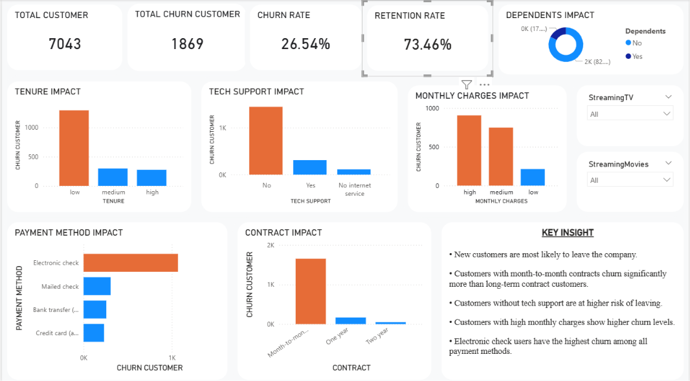

# Telecom Customer Churn Analysis

## Project Overview
This project analyzes telecom customer churn to identify the key factors causing customers to leave the company. Using Python for data cleaning and exploratory analysis, and Power BI for dashboard visualization, the project provides actionable business insights to improve customer retention.

---

## Business Problem
Customer churn directly impacts revenue and long-term business growth. The goal of this project is to identify which customer segments are most likely to churn and understand the major drivers behind churn.

---

## Dataset
Dataset contains **7043 telecom customers** with features such as:

- Gender  
- Senior Citizen  
- Partner / Dependents  
- Tenure  
- Tech Support  
- Contract Type  
- Payment Method  
- Monthly Charges  
- Total Charges  
- Churn Status  

---

## Tools Used
- Python  
- Pandas  
- NumPy  
- Power BI  

---

## Data Cleaning & Feature Engineering
Performed the following preprocessing steps:

- Removed duplicate records  
- Selected important business columns  
- Converted churn labels (Yes/No → 1/0)  
- Converted TotalCharges to numeric format  
- Created tenure groups (Low / Medium / High)  
- Created monthly charge groups  
- Generated cleaned dataset for dashboarding  

---

## Exploratory Data Analysis
Analyzed churn behavior across multiple business segments:

- Customer tenure  
- Contract type  
- Payment method  
- Tech support  
- Monthly charges  
- Dependents  

---

## Dashboard
Power BI dashboard includes:

- Total Customers KPI  
- Churn Customers KPI  
- Churn Rate  
- Retention Rate  
- Contract Impact  
- Payment Method Impact  
- Tech Support Impact  
- Monthly Charges Impact  

### Dashboard Preview

---

## Key Insights
- New customers are most likely to churn  
- Month-to-month contracts show the highest churn  
- Customers without tech support are at higher risk of leaving  
- High monthly charges correlate with higher churn  
- Electronic check users have the highest churn rate  

---

## Business Recommendations
- Improve onboarding for new customers  
- Strengthen tech support services  
- Offer attractive long-term contract plans  
- Provide retention discounts for high-risk customers  
- Improve payment convenience for electronic check users  

---

## Project Outcome
This analysis helps businesses identify churn drivers and build targeted retention strategies to reduce customer loss and improve customer lifetime value.
